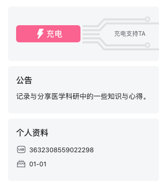
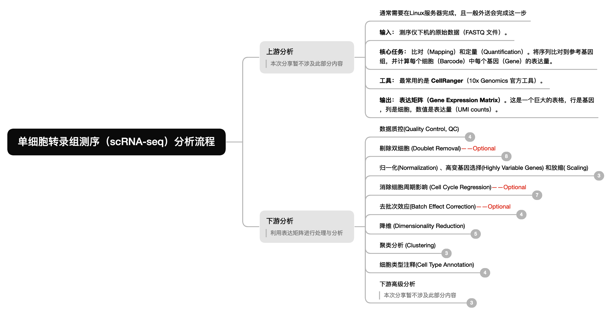

# 🧬 单细胞测序分析全流程代码 

## 📖 项目简介

本项目是一套覆盖**单细胞 RNA 测序（scRNA-seq）全分析流程**的 R 脚本集合，从原始数据读取到细胞类型注释一站式覆盖，适合单细胞分析初学者快速复现标准流程。

本项目的脚本大部分来源于：
- 开源生信教程与公共代码；
- 本人学习与理解后修改完善；
- 借助 AI（如 ChatGPT）优化代码结构与注释。  

🙏 **感谢所有开源项目的贡献者们！**  
希望本项目能帮助单细胞分析初学者理解标准分析流程，并继续传承开源精神。  

---

## 🎥 教学视频 & 支持作者

📺 **教学视频将逐步上传至 Bilibili：**  
UP 主：**[Broca区想发言](https://space.bilibili.com/3632308559022298)**  
欢迎关注以获取详细讲解视频与更新通知！

💖 **如果您觉得内容对您有帮助：**  
- 欢迎点一个 ⭐️ 支持开源！
- 也可以在 B 站 **充电** 支持我；  
- 或通过 **微信赞赏** 支持持续更新；  

您的鼓励将是我持续高质量更新的动力！

| B站充电 | 微信赞赏 |
|:--:|:--:|
|  |  |

---

## 📊 分析流程概览

本项目的代码逻辑遵循以下单细胞分析工作流：

同时附上[完整思维导图](images/Mind_map.png)，搭配视频讲解风味更佳~

---

## 📂 脚本功能详细说明

建议按照编号顺序依次运行脚本。文件名中包含 `Optional` 的为可选步骤，视数据情况决定是否执行。

| 脚本名称 | 功能简介 | 备注 |
|:---|:---|:---|
| `0.Sort_10X.R` | **数据整理** | 整理 10X 原始数据文件夹结构，以便批量读取 |
| `1.Data_Reading_multiple.R` | **数据读取** | 多种方法读取scRNA-seq数据矩阵，创建 Seurat 对象 |
| `2.Data_QC.R` | **质量控制** | 计算线粒体/红细胞比例，过滤低质量细胞 |
| `2.Data_QC_pct.R` | **质控（百分比版）** | 按照上限比例过滤低质量细胞，适用于样本间测序差异较大的数据 |
| `2.Data_Doublet_ Optional.R` | **去双细胞** | 使用 DoubletFinder 去除双细胞 (**可选**) |
| `3.Data_Normalize.R` | **数据预处理** | 数据标准化、高变基因查找、归一化 |
| `3.Data_CellCycle_Optional.R` | **细胞周期** | 细胞周期评分与回归消除 (**可选**) |
| `4.Dimensionality_Reduction.R` | **基础降维聚类** | 标准 PCA & UMAP/t-SNE 以及聚类(**适用于无批次效应数据**) |
| `4.Dimensionality_Reduction_harmony.R`| **去批次降维聚类** | 使用 Harmony 进行多样本整合与去批次 (**可选**) |
| `5.Annotation_Auto.R` | **自动注释** | 使用 SingleR 工具结合参考集自动注释 |
| `5.Annotation_Manual.R` | **手动注释** | 基于 Marker Gene 列表进行人工细胞类型定义 |
| `6.1 scRNA_DEG_by_Group.R` | **差异基因分析（组别）** | 在**同一细胞类型**中比较不同实验组/条件（如 Control vs Treatment）的差异基因 |
| `6.2 scRNA_DEG_by_Subtype.R` | **差异基因分析（亚型）** | 在**同一大类细胞类型**内比较不同细胞亚型之间的差异表达 |
| `7.DEG_GO_KEGG.R` | **功能富集分析** | 对差异基因进行 GO / KEGG 通路富集分析，解析生物学功能 |

---

🌟 感谢您看到这里。
